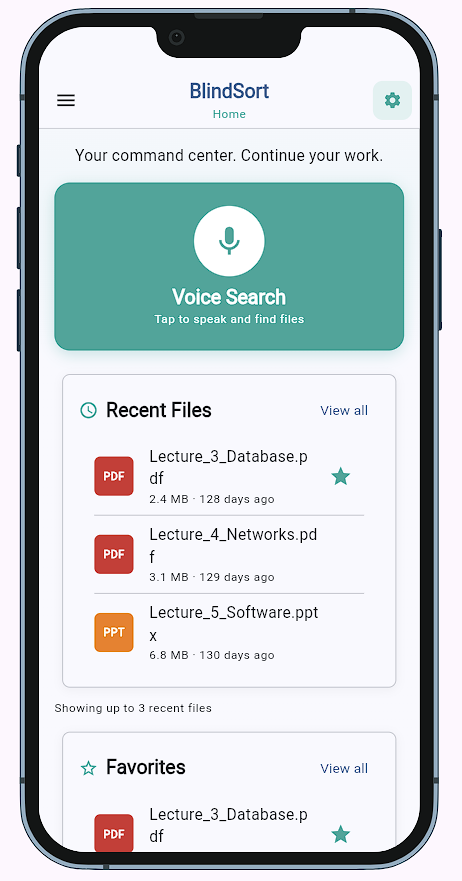
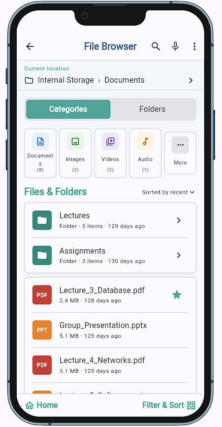
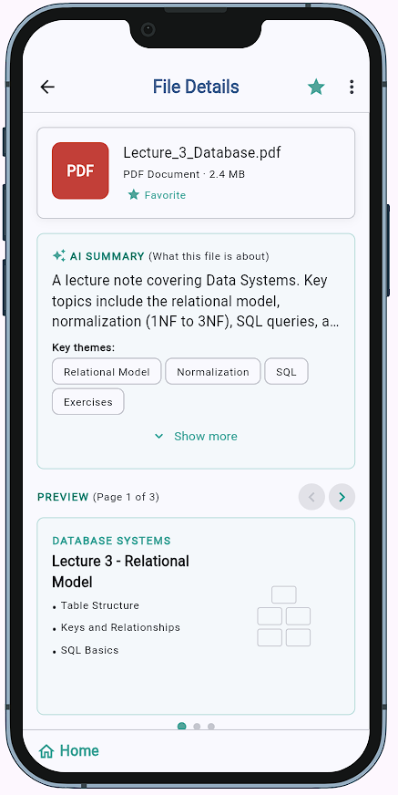
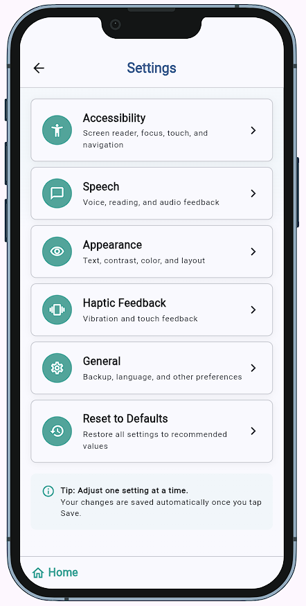

# BlindSort

BlindSort is an accessibility-first file manager for blind and low-vision
Android users. It speaks file names, types, and metadata so a user can find
what they need without reading a screen, and it organises files through
screen-reader-friendly navigation, virtual categories, and voice-assisted
search.

> Week 2 status: the four approved screens are built and reachable. File
> Browser, File Details, Settings, and the App Drawer are working. Voice
> Search is a visual teaser only. Disk persistence and live AI insights are
> still in progress.

**Live demo:** https://mog4ku-mono.github.io/blindsort/
**Demo video:** not yet available
**Course:** Applications Development and Emerging Technologies (6ADET), Holy Angel University
**Author:** [mog4ku-mono](https://github.com/mog4ku-mono)

This repository lives in the author's own GitHub account and is public on
purpose for coursework review. No name, student number, or personal email
appears in any file.

---

## Screenshots

Captured from the current Flutter web build at a 390 × 844 phone viewport.

| Home Dashboard | File Browser |
| --- | --- |
|  |  |

| File Details | Settings |
| --- | --- |
|  |  |

## What it does

- **Browses files with a screen reader.** Every file row and every folder row
  is wrapped in a `Semantics` node so TalkBack reads the file name, type,
  size, and modified date as a single unit.
- **Sorts and filters.** Category tiles narrow the file list to Documents,
  Images, Videos, Audio, Apps, Archives, Favorites, or Downloads. A "Sorted by"
  menu orders by recent, name, or size.
- **Opens a File Details view.** Tapping any file opens a screen with an AI
  summary, a swipeable preview carousel, metadata (location, modified, type),
  and three action buttons.
- **Manages custom folders.** Create, rename, and delete folders. Add or
  remove files with a multi-select picker that highlights selected rows with a
  teal strip.
- **Favorites and Recently Deleted.** Long-press any file to favorite it, move
  it to a folder, or delete it. Deleted files land in the App Drawer's
  Recently Deleted section and can be restored.
- **Adjusts accessibility settings.** Accessibility, Speech, Appearance,
  Haptic Feedback, and General settings are grouped in the Settings screen
  with Save and Revert.

## Built with

| | |
| --- | --- |
| Framework | Flutter (Dart), Material 3 |
| State | `setState` and a shared `AppState` singleton with `ValueNotifier` for theme mode |
| Storage | In-memory only for now; `shared_preferences` is the next increment |
| Visual preview | `device_preview`, kept on in the deployed build so the browser demo shows at phone size |
| Other packages | `cupertino_icons` |

## Running it yourself

```bash
git clone https://github.com/mog4ku-mono/blindsort.git
cd blindsort
flutter pub get
flutter run -d web-server --web-port 8080
```

Then open http://localhost:8080.

Verified with Flutter 3.44.4 (stable) and Dart 3.12.2. No environment
variables, API keys, or backend URLs are needed for the current build.

## Project structure

```text
lib/
├── main.dart                         # app entry, DevicePreview wrapper, theme mode listener
├── theme.dart                        # light and dark Material 3 themes
├── constants/
│   ├── app_spacing.dart              # 8px spacing scale
│   ├── category_colors.dart          # colour pair per category tile
│   └── file_type_colors.dart         # badge colour per file extension
├── data/
│   ├── file_insights.dart            # controlled per-file summaries and preview pages
│   ├── sample_files.dart             # controlled 15-file demo dataset
│   └── sample_folders.dart           # two sample folders
├── models/
│   ├── file_item.dart
│   └── folder_item.dart
├── screens/
│   ├── home_screen.dart              # dashboard: voice hero, recent, favorites, categories
│   ├── file_browser_screen.dart      # categories/folders tabs, filter, sort
│   ├── file_details_screen.dart      # hero, summary, swipeable preview, actions
│   └── settings_screen.dart          # six cards, inline sheets, save/revert
├── state/
│   └── app_state.dart                # shared session state and theme notifier
└── widgets/
    ├── app_drawer.dart               # navigation, Recently Deleted, Storage, About
    ├── category_navigation_item.dart
    ├── empty_state.dart
    ├── file_actions_sheet.dart       # shared long-press menu for files
    ├── file_list_item.dart
    ├── file_multi_picker.dart        # multi-select for folder contents
    ├── folder_list_item.dart
    ├── primary_button.dart
    ├── section_card.dart
    ├── settings_item.dart
    └── voice_search_overlay.dart     # full-screen listening tease
```

## Privacy and secrets

The current build is entirely local. Every file, folder, favorite, and setting
lives in the browser session and nothing is sent to a server. There is no
backend, no user account, and no API call. The repository contains no real
API keys, tokens, or passwords. All sample files are synthetic and do not
correspond to any real person, file, or device. The Gemini integration
described in the proposal was not attempted, so no Gemini key exists.

## Known issues and next steps

- **No persistence.** `AppState` is a static class that lives in memory for
  the session. Reloading the page resets favorites, custom folders, deleted
  items, and settings back to their defaults. The `shared_preferences` spike
  is the next task.
- **Voice Search is a visual tease.** The overlay shows a pulsing mic and a
  cycling status message, then opens the File Browser after a delay. Speech
  recognition is not wired.
- **File Insights uses sample data.** The AI Summary block on File Details is
  driven by `file_insights.dart`, not a live model. A Gemini integration is a
  stretch goal.
- **The widget test fails on CI.** It builds the app directly instead of
  inside the `DevicePreview` wrapper. The build and deploy still succeed
  because the workflow marks the test as `continue-on-error`.
- **No real Android file access.** The browser build uses a controlled
  dataset. On a real device the app would read from the filesystem; that is a
  stretch goal per the revised proposal.
- **Dark theme contrast on File Details action buttons** could be improved
  for high-contrast users.
- **No screen reader test on a real device.** Every interactive widget has a
  `Semantics` label, but no TalkBack session has been run end-to-end.

Next: the persistence spike, then the widget test fix, then filling in
`AI-USAGE.md` for the finals badge.

## Project documentation

| Document | |
| --- | --- |
| [Proposal](docs/01-proposal.md) | the problem, users, scope, and storage decision |
| [Mockup and wireframes](docs/02-mockup.md) | what each screen looks like |
| [Design system](docs/03-design-system.md) | palette, type, spacing, components |
| [Weekly reports](docs/04-weekly-reports.md) | one entry per week |
| [Security and privacy](docs/06-security-and-privacy.md) | repository security state |

## AI use

If you used AI while building this, say so here. Honest disclosure is the
standard in this course and increasingly outside it, and reporting heavy use
accurately costs you nothing.


Assistant used: ChatGPT and Claude. Roughly 60-70% of the code was
AI-assisted; the rest (data model, layout decisions, sample data, and the
design decisions that match the midterm mockup) was written or adjusted by me.
Full account in [AI-USAGE.md](AI-USAGE.md).

## Licence

All Rights Reserved. See [LICENSE](LICENSE). This repository is publicly
visible for coursework review only and does not grant any license to use,
copy, or redistribute.