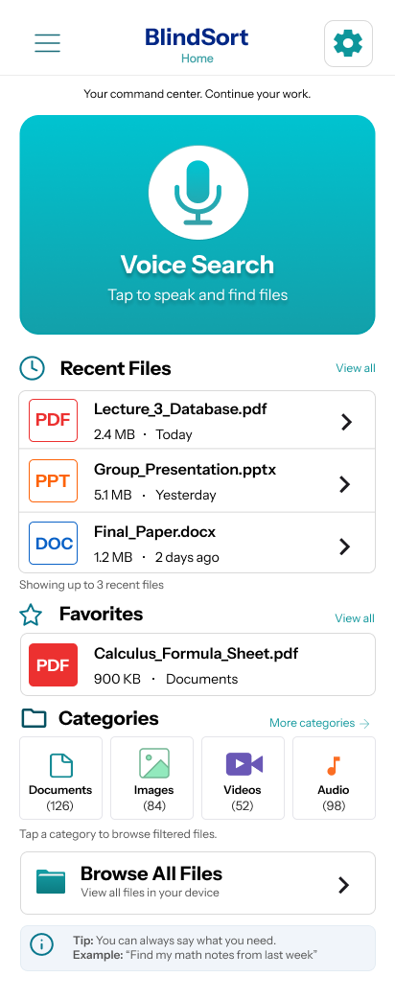
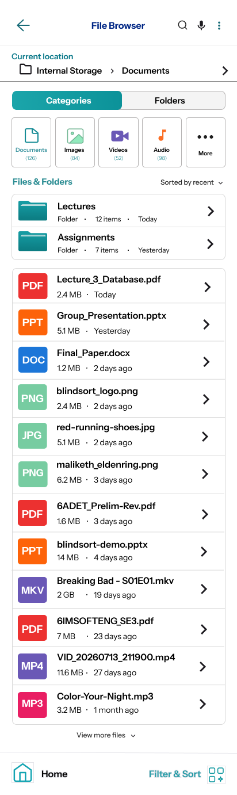
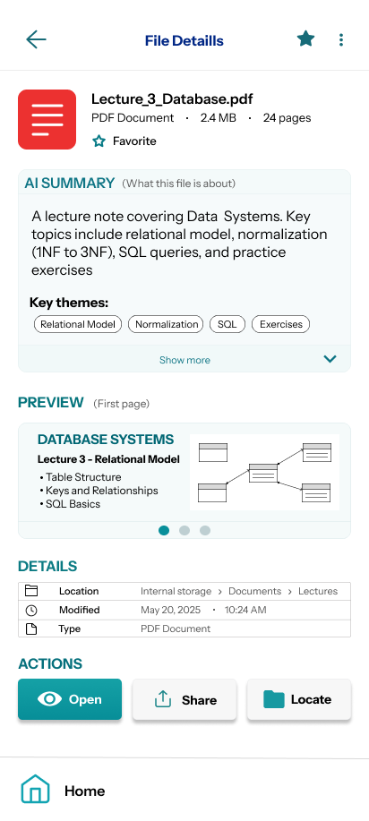
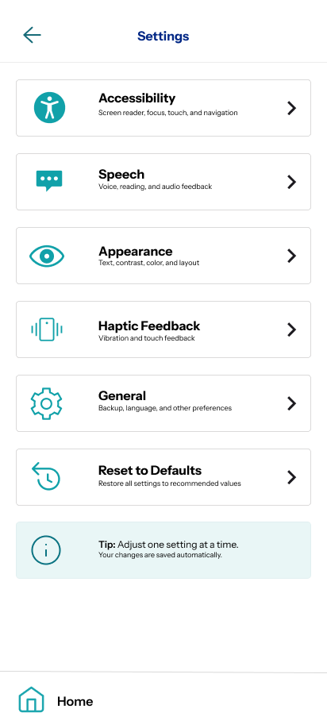

# Mockup and wireframes

The visual plan for BlindSort. The screen flow starts on the Home Dashboard,
moves into the File Browser, opens a File Details view for any selected file,
and lets the user manage preferences in Settings.

## Mockup

The complete editable reference is available in Figma:

- [BlindSort wireframes — high and low fidelity](https://www.figma.com/design/T6uVw8d66oxVNSYWP5y3M9/blindsort-by-alfred--cs-302-_--mog4ku-mono-?node-id=0-1&t=U7oO8QxnsKlq8jWb-1)
- [High-fidelity wireframe presentation (Android Compact)](https://www.figma.com/proto/T6uVw8d66oxVNSYWP5y3M9/blindsort-by-alfred--cs-302-_--mog4ku-mono-?node-id=49-914&p=f&t=OJhBW9MBfuJiqRtc-0&scaling=scale-down&content-scaling=fixed&page-id=49%3A565&starting-point-node-id=49%3A914)

The exported PNG images below are the visual deliverable for the high-fidelity
mockup.

### Home Dashboard



*Figure 1. Home Dashboard — overview of recent files, favorites, categories,
and the voice search hero.*

### File Browser



*Figure 2. File Browser — Categories/Folders tabs, breadcrumb, file list, and
sort control.*

### File Details



*Figure 3. File Details — hero card, AI summary, preview carousel, details
table, and action buttons.*

### Settings



*Figure 4. Settings — six preference cards with inline controls.*

## Wireframes

The wireframe-level flow is linear and phone-sized. Every screen is reachable
from Home, and back navigation returns the user to the previous screen without
losing state.

```text
Home Dashboard
  ├── Voice Search ──────> [listening overlay] ──> route by intent
  ├── Recent Files ──────> File Details
  ├── Favorites ─────────> File Details
  ├── Categories ────────> File Browser (filtered)
  ├── Browse All Files ──> File Browser
  └── App Drawer
        ├── File Browser
        ├── Settings
        ├── Recently Deleted
        ├── Storage
        └── About

File Browser
  ├── Categories tab  ───> filter tiles, folder list, file list
  ├── Folders tab     ───> folder list only
  ├── Search          ───> filter the file list
  ├── Voice           ───> route by intent
  └── File row        ───> File Details

File Details
  ├── Favorite toggle (app bar and hero card)
  ├── AI Summary (expand/collapse)
  ├── Preview carousel (swipeable, 1–3 pages)
  ├── Details table
  └── Actions
        ├── Open   (placeholder dialog — real file open is a stretch goal)
        ├── Share  (share sheet)
        └── Locate (snackbar with file location)

Settings
  ├── Accessibility
  ├── Speech
  ├── Appearance (includes dark mode toggle)
  ├── Haptic Feedback
  ├── General
  └── Reset to Defaults
```

The mockup exports above are the current screen-level visual reference. The
implementation keeps one primary action per screen and makes every state
reachable without relying on color alone.

## Screens

### Home Dashboard

Entry point. Shows a voice search hero, a Recent Files section with the three
most recently modified files, a Favorites section, a category grid
(Documents, Images, Videos, Audio), a Browse All Files shortcut, and a tip
card. Tapping any file opens File Details. Tapping any category opens the File
Browser pre-filtered. Long-pressing a file opens the actions sheet.

### File Browser

Two tabs. **Categories** shows category tiles, a folder group, and a file
group; **Folders** shows only folders. Tapping a category tile filters the
file list. Tapping a folder narrows the file list to that folder's contents
and updates the breadcrumb. Search in the app bar filters by name. Sort menu
orders by recent, name, or size. Long-pressing any file opens the actions
sheet; long-pressing a folder opens folder actions.

### File Details

One screen per file. A hero card shows the file type badge, name, size, and
favorite state. An AI Summary section shows a per-file summary with an
expand/collapse toggle and a row of "key themes" chips. A Preview section
holds a swipeable carousel (one to three pages) with left/right chevrons in
the header. A Details table shows Location, Modified, and Type. The Actions
row has Open, Share, and Locate, each with a working handler.

### Settings

Six cards. Accessibility, Speech, Appearance, Haptic Feedback, and General
each open a bottom sheet with inline controls (toggles and dropdowns). Every
toggle turns teal when on. Pending changes highlight the card border, and a
Save/Revert bar appears at the bottom. Appearance contains the dark mode
toggle, which applies to the whole app. Reset to Defaults shows a
confirmation dialog and returns every setting to its starting value.