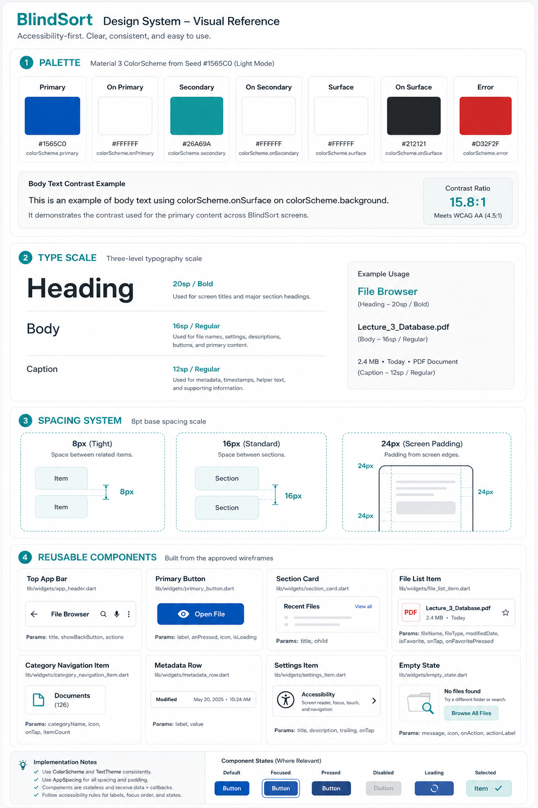

# Design system

BlindSort uses an accessibility-first Material 3 visual language designed for
one reader: a blind or low-vision Android user navigating a file manager with
TalkBack. Every design decision prioritises clarity over decoration,
predictability over novelty, and consistency across the four screens.

The written reference is this document. The visual reference is available
below.

## Palette

The BlindSort palette is generated from a single seed color using Flutter's
Material 3 `ColorScheme.fromSeed`. The seed is the deep blue `#1565C0` carried
over from the original design system. All semantic roles are derived from it,
which means every widget reads `Theme.of(context).colorScheme.*` and no widget
hardcodes a color.

| Role | Value | Use |
| --- | --- | --- |
| Primary | `#1565C0` (seed) | Primary actions, active states, screen titles |
| Secondary | Teal, derived from seed — overridden to `#26A69A` for section labels, category tiles, and the voice hero | Secondary actions and category emphasis |
| Surface | White in light mode | Cards, sheets, dialogs |
| On Surface | Near black | Body text and icons |
| Error | Material error red | Validation and destructive actions |

Dark mode uses the same seed and generates a parallel dark ColorScheme. The
`secondary` override to teal is kept in both themes so the app's identity is
consistent.

## Type scale

Three text roles cover the four screens. Every widget references the named
`TextTheme` slot rather than hardcoding a size.

| BlindSort style | Flutter slot | Size | Weight | Use |
| --- | --- | --- | --- | --- |
| Heading | `headlineSmall` | 20sp | Bold | Screen titles and section headings |
| Body | `bodyMedium` | 16sp | Regular | File names, buttons, descriptions |
| Caption | `labelSmall` | 12sp | Regular | Metadata, timestamps, helper text |

## Spacing

BlindSort uses an 8px base unit. Spacing decisions live as named constants in
`lib/constants/app_spacing.dart` so no widget hardcodes a number.

| Constant | Value | Use |
| --- | --- | --- |
| `AppSpacing.xs` | 4px | Very small internal relationships |
| `AppSpacing.sm` | 8px | Tight spacing between list items |
| `AppSpacing.md` | 16px | Standard padding, screen edge |
| `AppSpacing.lg` | 24px | Larger section separation |

## Components

Every reusable widget lives under `lib/widgets/`, receives data and callbacks
through its constructor, and never calls `setState` on the parent's behalf.

| Widget | File | Parameters | Used on |
| --- | --- | --- | --- |
| `AppHeader` | `lib/widgets/app_header.dart` | `title`, `showBackButton`, `actions` | All screens |
| `SectionCard` | `lib/widgets/section_card.dart` | `title`, `leadingIcon`, `child`, `trailing` | Home, File Details |
| `FileListItem` | `lib/widgets/file_list_item.dart` | `file`, `isFavorite`, `isSelected`, `onTap`, `onLongPress` | Home, File Browser |
| `FolderListItem` | `lib/widgets/folder_list_item.dart` | `folder`, `itemCount`, `onTap`, `onLongPress` | File Browser |
| `CategoryNavigationItem` | `lib/widgets/category_navigation_item.dart` | `categoryName`, `icon`, `tintColor`, `foregroundColor`, `itemCount`, `onTap` | Home, File Browser |
| `PrimaryButton` | `lib/widgets/primary_button.dart` | `label`, `onPressed`, `icon`, `isLoading` | Home, File Details |
| `MetadataRow` | `lib/widgets/metadata_row.dart` | `label`, `value`, `icon` | File Details |
| `SettingsItem` | `lib/widgets/settings_item.dart` | `title`, `icon`, `description`, `trailing`, `onTap`, `outlined` | Settings |
| `EmptyState` | `lib/widgets/empty_state.dart` | `message`, `icon`, `onAction`, `actionLabel` | Home, File Browser, File Details |
| `AppDrawer` | `lib/widgets/app_drawer.dart` | `onOpenBrowser`, `onOpenSettings`, `onClose` | Home |
| `FileActionsSheet` | `lib/widgets/file_actions_sheet.dart` | `context`, `file`, `onChanged` | Home, File Browser |
| `FileMultiPicker` | `lib/widgets/file_multi_picker.dart` | `context`, `folderName`, `onChanged` | File Browser |
| `VoiceSearchOverlay` | `lib/widgets/voice_search_overlay.dart` | `context`, `files` | Home, File Browser |

Component rules:

1. **Receive data and callbacks.** No business logic inside the widget.
2. **Do not call `setState`.** The parent owns state.
3. **Use `const` where possible.**
4. **Read from `Theme.of(context)`.** No hardcoded colors or font sizes.
5. **Accessibility first.** Every interactive widget has a `Semantics` node
   with a label describing the action.

## Changes since the last version

- **2026-09-30 — Palette expanded.** The design system v2 shipped with a
  light-only ColorScheme. The final build adds a dark theme generated from
  the same seed. The light ColorScheme remains the default; the dark
  ColorScheme is a scope addition, not a redesign.
- **2026-09-30 — Component list grew.** The original list of eight reusable
  widgets was expanded to thirteen. The additions were `AppDrawer`,
  `FileActionsSheet`, `FileMultiPicker`, and `VoiceSearchOverlay`, all of
  which came from features added during the finals build (drawer navigation,
  long-press actions, folder file management, and voice search).
- **2026-09-30 — `secondary` overridden to teal.** Material 3 generates a
  muted slate as the secondary role when the seed is blue. To preserve the
  teal visual identity from the mockup, `secondary`, `secondaryContainer`,
  and `onSecondaryContainer` are overridden explicitly in the `ColorScheme`.